# 分配器

## 分配器

### c++中的new和delete

#### 1、new operator

new operator就是new操作符，平时使用的new（如`int *pt = new object(...);`）主要完成两个工作：

1.  分配足够的内存以便容纳所需类型的对象（operator new）
2.  调用构造函数初始化内存中的对象（placement new）

#### 2、operator new

new操作符为分配内存所调用函数的名字是operator new，就是间接性的调用了 malloc函数。

源码：

```cpp
void* __CRTDECL operator new(size_t const size)
{
    for (;;)   // 保持尝试分配内存直到成功为止
    {
        // 使用malloc函数分配内存。如果分配成功（即malloc返回非空指针)
        if (void* const block = malloc(size))
        {
            return block;
        }

        if (_callnewh(size) == 0)
        {
            if (size == SIZE_MAX)
            {
                __scrt_throw_std_bad_array_new_length();
            }
            else
            {
                __scrt_throw_std_bad_alloc();
            }
        }
    }
}
```

#### 3、placement new

placement new用来在已经申请的内存上构建对象，其实不只是堆, 连栈上也能构建对象，这也是内存池经常用的方法。		
尝试一波：

```cpp
#include <iostream>

class test
{
private:
	int one;
public:
	test():one(9) {}
};

int main()
{
	char buffer[4] = { 0 };
	test *pt = new(buffer) test;

	system("pause");
	return 0;
}
```

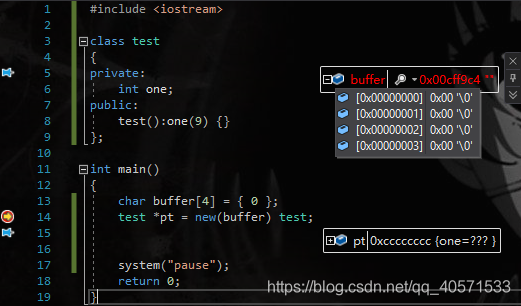  
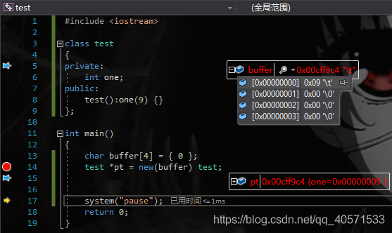

#### 实际测试

```cpp
#include <iostream>

class test
{
private:
	int one;
public:
	test():one(9) {}
};

int main()
{
	test *pt1 = new test;

    // pt2指向已经申请的内存
	test *pt2 = (test*)operator new(sizeof(test));

    // 属于placement new，在已经申请的pt2内存上构建对象
	test *pt3 = new(pt2) test;

	system("pause");
	return 0;
}
```

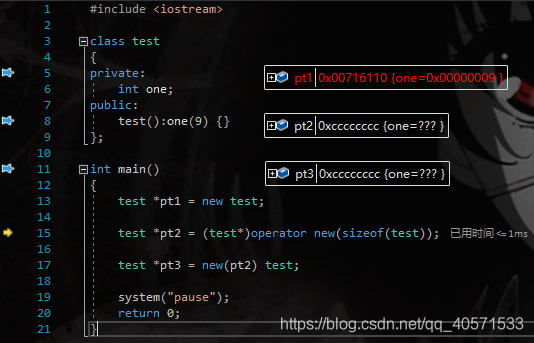  
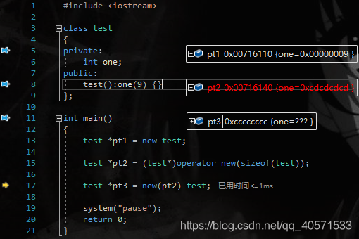  
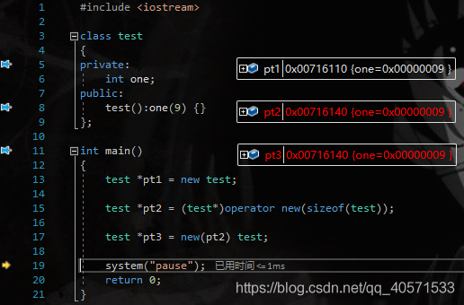  
**可以看见pt1(new operator)的效果就是pt2(operator new)+pt3(placement new)。**

#### delete

delete的实现也是跟new有很多相似的, delete事先调用析构函数, 然后再调用free函数释放内存, 同样是可以将析构和释放内存分开调用, 也可以进行重载。

相当于跟new反过来，new是先分配足够的内存以便容纳所需类型的对象，再调用构造函数初始化内存中的对象

### STL分配器

**分配器将new的申请空间（allocate）和调用构造函数（construct）的两个功能分开实现。**

#### 基本的构造和析构工具

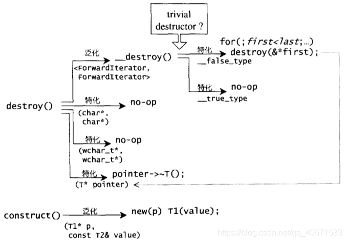

##### construct

```cpp
template <class T1, class T2>
inline void construct(T1* p, const T2& value) 
{
    new (p) T1(value);
}
```

**construct调用的是placement new, 在一个已经获得的内存里建立一个对象。**

##### delete

destroy调用析构函数并且有两个版本   

版本一传入指针直接就调用了析构函数：

```cpp
template <class T> inline void destroy(T* pointer) 
{
    pointer->~T();
}
```

版本二需要传入两个迭代器，并且根据是否有自定义的析构函数来执行析构：

```cpp
// 接受两个迭代器, 并设法找出元素的类型。
template <class ForwardIterator>
inline void destroy(ForwardIterator first, ForwardIterator last) 
{
    __destroy(first, last, value_type(first));
}

template <class ForwardIterator, class T>
inline void __destroy(ForwardIterator first, ForwardIterator last, T*) 
{
    // 分析是否有traival destructor（系统自带的析构函数）。
    typedef typename __type_traits<T>::has_trivial_destructor trivial_destructor;
    __destroy_aux(first, last, trivial_destructor());
}
```

这是我们后面经常能看到的情况，根据对类的信息的判断做出相应的处理。

```cpp
// 当__type_traits为__false_type时，通过迭代所有的对象并调用版本一的函数执行析构函数进行析构。
template <class ForwardIterator>
inline void __destroy_aux(ForwardIterator first, ForwardIterator last, __false_type) 
{
    for ( ; first < last; ++first)
        destroy(&*first);
}

// 当__type_traits为__true_type时, 什么也不做, 因为这样效率很高效, 并不需要执行析构函数。
template <class ForwardIterator> 
inline void __destroy_aux(ForwardIterator, ForwardIterator, __true_type) {}

// 对字符指针的特化版本
inline void destory(char*, char*) {}
inline void destory(wchar_t*, wchar_t*) {}
```

#### allocate

allocate申请内存是有分为一级配置器（\_\_malloc\_alloc\_template ）和二级配置器（\_\_default\_alloc\_template）, 分配的空间小于128字节的就调用二级配置器, 大于就直接使用一级配置器, 一级配置器直接调用malloc申请, 二级使用内存池。

SGI包装的接口（不管是一级配置器还是二级配置器都是使用这个接口进行分配的，四个成员都是单纯干掉转调用）：

```cpp
template<class T, class Alloc>
class simple_alloc
{
  public:
    static T *allocate(size_t n)
    { return 0 == n? 0 : (T*) Alloc::allocate(n * sizeof (T)); }
    static T *allocate(void)
    { return (T*) Alloc::allocate(sizeof (T)); }
    static void deallocate(T *p, size_t n)
    { if (0 != n) Alloc::deallocate(p, n * sizeof (T)); }
    static void deallocate(T *p)
    { Alloc::deallocate(p, sizeof (T)); }
};
```

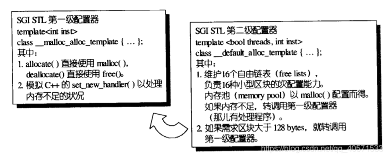  
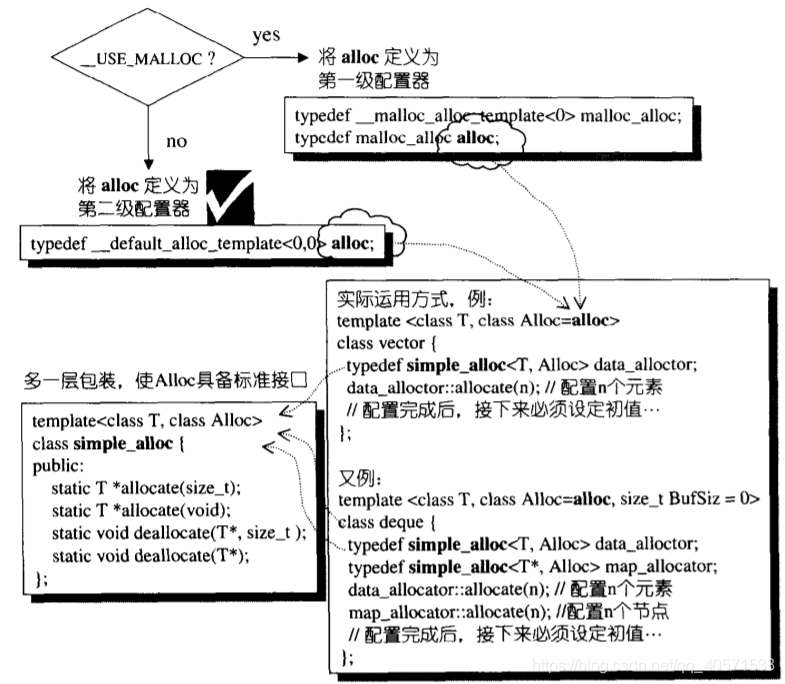

#### 一级配置器

一级配置器只是封装了`malloc`、`free`、`realloc`等c函数来进行内存的配置，并且在内存分配异常的时候可以执行用户指定的函数。

```cpp
// 一级配置器
// inst完全没派上用场
template <int inst>
class __malloc_alloc_template 
{
// 这里private里面的函数都是在内存不足的时候进行调用的
private:
    static void *oom_malloc(size_t);        // 分配不足
    static void *oom_realloc(void *, size_t);   // 重新分配不足
#ifndef __STL_STATIC_TEMPLATE_MEMBER_BUG
    static void (* __malloc_alloc_oom_handler)();   // 内存不足设置的处理例程, 默认设置的是0, 表示没有设置处理例程, 这个处理例程是由用户手动设置的
#endif

public:
	static void * allocate(size_t n)
	{
	      void *result = malloc(n);	// 一级配置器直接使用malloc
	      if (0 == result) result = oom_malloc(n);	// 当内存不足的时候调用oom_malloc
	      return result;
	}
	
	static void deallocate(void *p, size_t /* n */)
	{
	      free(p);	// 一级配置器直接使用free
	}
	
	static void * reallocate(void *p, size_t /* old_sz */, size_t new_sz)
	{
	      void * result = realloc(p, new_sz);	// 一级配置器直接使用realloc
	      if (0 == result) result = oom_realloc(p, new_sz);	// 当内存不足的时候调用oom_realloc
	      return result;
	}

	// 这里是模仿c++的set_new_handler. 是由用户自己定义的处理函数, 没有设置默认为0
	static void (* set_malloc_handler(void (*f)()))()
	{
	      void (* old)() = __malloc_alloc_oom_handler;
	      __malloc_alloc_oom_handler = f;
	      return(old);
	}
}

// 默认将处理例程设置为0, 只有用户自己设置
template <int inst>
void (* __malloc_alloc_template<inst>::__malloc_alloc_oom_handler)() = 0;

template <int inst>
void * __malloc_alloc_template<inst>::oom_malloc(size_t n)
{
	void (* my_malloc_handler)();
	void *result;
	// 不断尝试释放 配置内存
	for (;;) 
	{
		my_malloc_handler = __malloc_alloc_oom_handler;
		if (0 == my_malloc_handler) { __THROW_BAD_ALLOC; }
		(*my_malloc_handler)();	// 调用处理例程 企图释放内存
		result = malloc(n);		// 再次尝试配置内存
		if (result) return(result);
	}
}

template <int inst>
void * __malloc_alloc_template<inst>::oom_realloc(void *p, size_t n)
{
	void (* my_malloc_handler)();
	void *result;
	// 不断尝试释放 配置内存
	for (;;) {
		my_malloc_handler = __malloc_alloc_oom_handler;
		if (0 == my_malloc_handler) { __THROW_BAD_ALLOC; }
		(*my_malloc_handler)();	// 调用处理例程 企图释放内存
		result = realloc(p, n);	// 再次尝试配置内存
		if (result) return(result);
	}
}

// 默认将malloc_alloc设为0
typedef __malloc_alloc_template<0> malloc_alloc;
```

#### 二级配置器

因为比较小的内存会带来内存碎片等问题，并且也是一个内存负担。  
**二级配置器在分配超过128字节大小内存的时候使用一级配置器，否则使用内存池进行管理**。

内存池管理又称为层次配置：每次配置一大块内存，并维护对应的16个空闲链表（free-list）。下次若有相同大小的内存需求，则直接从free-list中取。如果有小额区块被释放，则由配置器回收到free-list中。16个空闲链表分别管理大小为8、16、24…120、128的数据块（为8的倍数方便管理）。

通过图片看一下：

1.  下面是空闲链表中管理8byte的，链接了3块可用的内存，三个use的内存已经分给用户了，不归空闲链表管，其他空白区域就是未分配的内存。  
    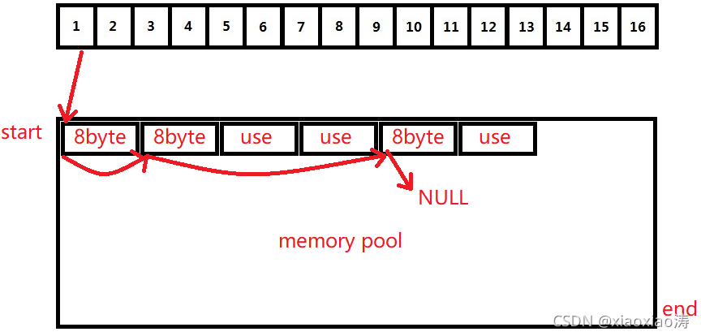
    
2.  分配出去一个8byte的内存  
    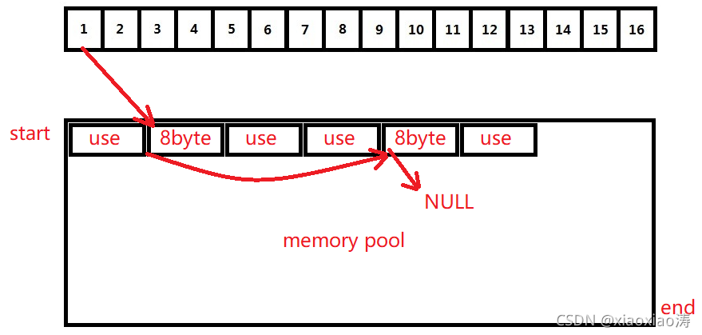
    
3.  回收中间16byte  
    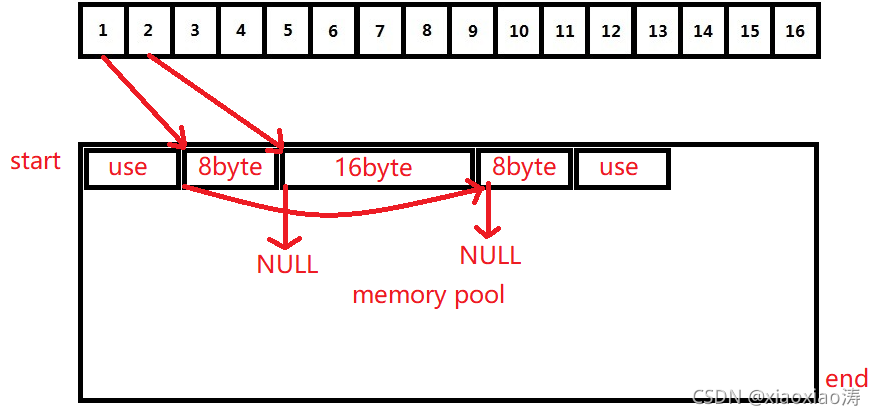
    

```cpp
enum {__ALIGN = 8}; // 设置对齐要求. 对齐为8字节, 没有8字节自动补齐
enum {__MAX_BYTES = 128};   // 第二级配置器的最大一次性申请大小, 大于128就直接调用第一级配置器
enum {__NFREELISTS = __MAX_BYTES/__ALIGN};  // 链表个数, 分别代表8, 16, 32....字节的链表

// 二级配置器
// threads用于多线程情况下不做讨论
// inst完全没派上用场
template <bool threads, int inst>
class __default_alloc_template
{
private:
	// 将bytes上调到8的倍数
	static size_t ROUND_UP(size_t bytes)
	{
	    return (((bytes) + ALIGN-1) & ~(__ALIGN - 1));
	}

	union obj
	{
	  union obj* free_list_link;  // 指向下一个区块
	  char client_data[1];        // 储存本块内存的首地址
	}

	// 16个freelist
	static obj * volatile free_list[__NFREELISTS];

	// 根据区块的大小决定使用第n个freelist n从1开始算起
	static size_t FREELIST_INDEX(size_t bytes)
	{
	    return (((bytes) + ALIGN-1) / __ALIGN - 1);
	}
	
	static void* refill(size_t n);
	static char* chunk_alloc(size_t size, int& nobjs);

	char *start_free;	// 内存池的首地址
	char *end_free;		// 内存池的结束地址
	size_t heap_size;	// 多次调用内存池, 就会更多的是给链表分配内存, 这就是一个增量.

public:
	static void * allocate(size_t n);
	static void deallocate(void *p, size_t n);
	static void * reallocate(void *p, size_t old_sz, size_t new_sz);
};

template <bool threads, int inst>
char *__default_alloc_template<threads, inst>::start_free = 0;
template <bool threads, int inst>
char *__default_alloc_template<threads, inst>::end_free = 0;
template <bool threads, int inst>
size_t __default_alloc_template<threads, inst>::heap_size = 0;
template <bool threads, int inst>
size_t __default_alloc_template<threads, inst>::obj * volatile size_t __default_alloc_template<threads, inst>::free_list[__NFREELISTS] = {0, 0, 0, 0, 0, 0, 0, 0, 0, 0, 0, 0, 0, 0, 0, 0};
```

空间配置函数allocate检查对应的空闲链表，如果该空闲链表中有可用数据块，则直接拿来用（拿取空闲链表中的第一个可用数据块，然后把该空闲链表的地址设置为该数据块指向的下一个地址），如果没有可用数据块，则调用refill重新填充空间。

```cpp
static void * allocate(size_t n)
{
	obj * __VOLATILE * my_free_list;
	obj * __RESTRICT result;
	// 先判断申请的字节大小是不是大于128字节, 是则交给第一级配置器来处理. 否则继续往下执行
	if (n > (size_t) __MAX_BYTES) 
	{
		return(malloc_alloc::allocate(n));
	}
	// 找到分配的地址对齐后分配的是第几个大小的链表 获得该链表指向的首地址
	my_free_list = free_list + FREELIST_INDEX(n);
	result = *my_free_list;
	if (result == 0) 	// 没有多余的内存, 就先填充链表.
	{
		void *r = refill(ROUND_UP(n));
		return r;
	}
	// 返回链表的首地址, 和一块能容纳一个对象的内存, 并更新链表的首地址
	*my_free_list = result -> free_list_link;
	return (result);
};
```

空间释放函数deallocate根据数据块的大小来判断回收后的空间会被插入到哪个空闲链表。

```cpp
static void deallocate(void *p, size_t n)
{
	obj *q = (obj *)p;
	obj * __VOLATILE * my_free_list;
	
	// 释放的内存大于128字节直接调用一级配置器进行释放
	if (n > (size_t) __MAX_BYTES) 
	{
		malloc_alloc::deallocate(p, n);
		return;
	}
	// 将内存直接还给对应大小的链表就行了, 并不用直接释放内存, 以便后面分配内存的时候使用
	my_free_list = free_list + FREELIST_INDEX(n);
	q -> free_list_link = *my_free_list;
	*my_free_list = q;
}
```

如果空闲链表中没有可用数据块，就会调用refill来重新填充空间，新的空间取自内存池。缺省取20个数据块，如果内存池空间不足，那么能取多少个节点就取多少个。

```cpp
template <bool threads, int inst>
void* __default_alloc_template<threads, inst>::refill(size_t n)
{
  	int nobjs = 20;
  	char * chunk = chunk_alloc(n, nobjs); // 向内存池申请空间的起始地址 nobjs为引用
  	obj * __VOLATILE * my_free_list;
  	obj * result;
  	obj * current_obj, * next_obj;
  	int i;

  	// 如果只申请到一个对象的大小, 就直接返回一个内存的大小
  	if (1 == nobjs) return(chunk);
  	my_free_list = free_list + FREELIST_INDEX(n);

  	// 申请的大小不止一个对象的大小的时候
  	result = (obj *)chunk;
  	// my_free_list指向内存池返回的地址的下一个对齐后的地址
  	*my_free_list = next_obj = (obj *)(chunk + n);
  	// 这里从第二个开始的原因主要是第一块地址返回给了用户, 现在需要把从内存池里面分配的内存用链表给串起来
  	for (i = 1; ; i++) 
  	{
	    current_obj = next_obj;
    	next_obj = (obj *)((char *)next_obj + n);
	    if (nobjs - 1 == i) 
        {
			current_obj -> free_list_link = 0;
      		break;
    	} 
        else 
        {
      		current_obj -> free_list_link = next_obj;
    	}
  	}
  	return(result);
}
```

从内存池取空间给空闲链表，首先根据end\_free-start\_free来判断内存池中的剩余空间是否足以调出nobjs个大小为size的数据块出去，如果内存连一个数据块的空间都无法供应，需要用malloc取堆中申请内存。

```cpp
template <bool threads, int inst>
char* __default_alloc_template<threads, inst>::chunk_alloc(size_t size, int& nobjs)
{
  	char * result;
  	size_t total_bytes = size * nobjs;            // 链表需要申请的内存大小
  	size_t bytes_left = end_free - start_free;    // 内存池里面总共还有多少内存空间

  	if (bytes_left >= total_bytes) // 内存池的大小大于需要的空间, 直接返回起始地址
  	{
	    result = start_free;
    	start_free += total_bytes;  // 内存池的首地址往后移
	    return(result);
  	}
  	else if (bytes_left >= size) // 内存池的内存不足以马上分配那么多内存, 但是还能满足分配一个即以上的大小, 那就按对齐方式全部分配出去
  	{
	    nobjs = bytes_left/size;
    	total_bytes = size * nobjs;
    	result = start_free;
    	start_free += total_bytes;  // 内存池的首地址往后移
    	return(result);
  	} 
  	else // 如果一个对象的大小都已经提供不了了, 那就准备调用malloc申请两倍+额外大小的内存
  	{
	    size_t bytes_to_get = 2 * total_bytes + ROUND_UP(heap_size >> 4);
    	// 内存池还剩下的零头内存分给给其他能利用的链表, 也就是绝不浪费一点.
    	if (bytes_left > 0) 
    	{
      		// 寻找合适的freelist加入其中
      		obj * __VOLATILE * my_free_list = free_list + FREELIST_INDEX(bytes_left);
      		((obj *)start_free) -> free_list_link = *my_free_list;
      		*my_free_list = (obj *)start_free;
    	}
    	// 申请空间
    	start_free = (char *)malloc(bytes_to_get);
    	// 内存不足了
    	if (0 == start_free) 
    	{
      		int i;
      		obj * __VOLATILE * my_free_list, *p;
      		// 充分利用剩余链表的内存, 通过递归来申请
      		for (i = size; i <= __MAX_BYTES; i += __ALIGN) 
      		{	
	        	my_free_list = free_list + FREELIST_INDEX(i);
	        	p = *my_free_list;
	        	if (0 != p) 
	            {
	            	// 找到未使用的区块 递归分配
	          		*my_free_list = p -> free_list_link;
          			start_free = (char *)p;
	          		end_free = start_free + i;
          			return(chunk_alloc(size, nobjs));
    	    	}
      		}
      		// 如果一点内存都没有了的话, 就只有调用一级配置器来申请内存了, 并且用户没有设置处理例程就抛出异常
      		end_free = 0;
      		start_free = (char *)malloc_alloc::allocate(bytes_to_get);
	    }
    	// 申请内存成功后重新修改内存起始地址和结束地址, 重新调用chunk_alloc分配内存
    	heap_size += bytes_to_get;
    	end_free = start_free + bytes_to_get;
   		return(chunk_alloc(size, nobjs));
  	}	
}
```

## MyTinySTL分配器

涉及到的文件construct.h、allocator.h。  
这边配置器取消掉了内存池，所以看起来就非常简单了。  
有一些traits萃取剂相关内容会在迭代器中详细解释。

**分配器将new的申请空间（allocate）和调用构造函数（construct）的两个功能分开实现。**

### construct

构造直接调用了placement new

```cpp
template <class Ty>
void construct(Ty* ptr)
{
	::new ((void*)ptr) Ty();
}

// construct调用的是placement new, 在一个已经获得的内存里建立一个对象。
template <class Ty1, class Ty2>
void construct(Ty1* ptr, const Ty2& value)
{
	::new ((void*)ptr) Ty1(value);
}

template <class Ty, class... Args>
void construct(Ty* ptr, Args&&... args)
{
	::new ((void*)ptr) Ty(mystl::forward<Args>(args)...);
}
```

### destroy

析构单个对象，这边调用了`std::is_trivially_destructible`用来判断是否有系统默认的析构函数，如果是系统默认的析构函数就没有必要执行。

```cpp
template <class Ty>
void destroy(Ty* pointer)
{
	destroy_one(pointer, std::is_trivially_destructible<Ty>{});
}

/*! 普通可破坏类型 */
// 用户没有自定义析构函数，则用系统默认，{}空操作什么都不用干
template <class Ty>
void destroy_one(Ty*, std::true_type) {}

/*! 有自定义的析构函数 */
template <class Ty>
void destroy_one(Ty* pointer, std::false_type)
{
	if (pointer != nullptr)
	{
		pointer->~Ty();
	}
}
```

析构两个迭代器之间全部对象

```cpp
template <class ForwardIter>
void destroy(ForwardIter first, ForwardIter last)
{
	// 按照迭代器种类分类处理
    // iterator_traits<ForwardIter>：iterator_traits 是一个模板类，用于获取迭代器类型的特征信息。通过传入模板参数 ForwardIter，可以获取到 ForwardIter 迭代器的特征信息。
    // typename iterator_traits<ForwardIter>::value_type：通过 iterator_traits<ForwardIter> 获取到的特征信息中，使用 value_type 成员类型来获取迭代器指向的元素类型。
    // std::is_trivially_destructible<typename iterator_traits<ForwardIter>::value_type>：使用 std::is_trivially_destructible 类型特征来判断获取到的元素类型是否是平凡可销毁的。
    // {}：使用大括号初始化语法，创建一个匿名的 std::is_trivially_destructible 类型的临时对象。
	destroy_cat(first, last, std::is_trivially_destructible<typename iterator_traits<ForwardIter>::value_type>{});
}

/*! 普通可破坏类型 */
template <class ForwardIter>
void destroy_cat(ForwardIter, ForwardIter, std::true_type) {}

/*! 有自定义的析构函数 */
template <class ForwardIter>
void destroy_cat(ForwardIter first, ForwardIter last, std::false_type)
{
	for (; first != last; ++first)
	{
		destroy(&*first);
	}
}
```

- std::is_trivially_destructible\<typename iterator_traits\<ForwardIter\>::value_type\>{}整个语句的作用是判断迭代器 `ForwardIter` 指向的元素类型是否是平凡可销毁的，并返回一个 `std::is_trivially_destructible` 类型的临时对象。可以根据这个对象的值来判断元素类型是否是平凡可销毁的，如果值为 `true`，则表示该类型是平凡可销毁的，否则为 `false`。

- `&*first` 的目的是获取迭代器 `first` 所指向元素的地址。

  首先，`*first` 表达式会解引用迭代器 `first`，获取它所指向的元素。**这里迭代器并不是元素真正存放的地址。**

  然后，`&` 运算符被应用于解引用的结果，以获取该元素的地址。

  综上所述，`&*first` 的目的是获取迭代器 `first` 所指向元素的地址。这通常用于将元素的地址传递给其他函数进行处理，例如在 `destroy` 函数中销毁元素。

  

### allocate

分配器管理内存的分配、释放，对象的构造、析构，并且也知道数据的类型。

```cpp
template <class T>
class allocator
{
public:
	typedef T            value_type;		/*! 数据类型 */
	typedef T*           pointer;			/*! 数据类型指针 */
	typedef const T*     const_pointer;		/*! const数据类型指针 */
	typedef T&           reference;			/*! 数据类型引用 */
	typedef const T&     const_reference;	/*! const数据类型引用 */
	typedef size_t       size_type;			/*! 数据类型大小 */
	typedef ptrdiff_t    difference_type;	/*! 数据类型指针距离 */

public:
	// 分配内存
	static T*   allocate();
	static T*   allocate(size_type n);

	// 回收内存
	static void deallocate(T* ptr);
	static void deallocate(T* ptr, size_type n);

	// 构造对象
	static void construct(T* ptr);
	static void construct(T* ptr, const T& value);
	static void construct(T* ptr, T&& value);

	template <class... Args>
	static void construct(T* ptr, Args&& ...args);

	// 析构对象
	static void destroy(T* ptr);
	static void destroy(T* first, T* last);
};
```

分配内存直接使用的operator new

```cpp

// 这是一个 C++ 中的模板函数 `allocate` 的定义，它是一个成员函数，属于`allocator` 类模板。 
// 这个函数的作用是在堆上分配一块内存，用于存储类型`T`的对象，并返回指向该内存块的指针。 
// 需要注意的是，这个函数只是分配了内存，但并没有调用 `T` 的构造函数来初始化对象。 因此，在使用这个函数分配内存后，还需要手动调用 `T`的构造函数来初始化对象。同时，在使用完对象后，还需要手动调用 `T` 的析构函数来释放资源。
template <class T>
T* allocator<T>::allocate()
{
    // 这个函数使用了 C++ 中的内存分配函数`operator new` 来分配内存
    // 然后使用 `static_cast`进行类型转换，将分配的内存块转换成类型 `T*` 的指针，最后返回该指针。
	return static_cast<T*>(::operator new(sizeof(T)));
}

template <class T>
T* allocator<T>::allocate(size_type n)
{
	if (n == 0)
	{
		return nullptr;
	}
	return static_cast<T*>(::operator new(n * sizeof(T)));
}
```

回收内存使用的operator delete

```cpp
// 这是一个 C++ 中的模板函数，它属于 `allocator` 类的成员函数。
// 这个函数的作用是释放一块内存，它接受两个参数：一个是指向要释放的内存块的指针，另一个是内存块的大小。


template <class T>
void allocator<T>::deallocate(T* ptr)
{
	if (ptr == nullptr)
	{
		return;
	}
	::operator delete(ptr);
}

template <class T>
void allocator<T>::deallocate(T* ptr, size_type /*size*/)
{
    // 在函数的实现中，首先判断要释放的指针是否为 `nullptr`，如果是则直接返回，
	if (ptr == nullptr)
	{
		return;
	}
    // 否则调用全局的 `operator delete` 函数释放内存。
    // 这个函数是 C++ 中的一个内置函数，用于释放由 `operator new` 分配的内存。
    // 在这个函数中，我们没有使用第二个参数 `size`，因为在 C++ 中，`delete` 操作符会自动获取要释放内存块的大小。
	::operator delete(ptr);
}
```

构造和析构对象直接调用的上面的construct和destroy，代码就不贴了。

**分配器将new的申请空间（allocate）和调用构造函数（construct）的两个功能分开实现。**